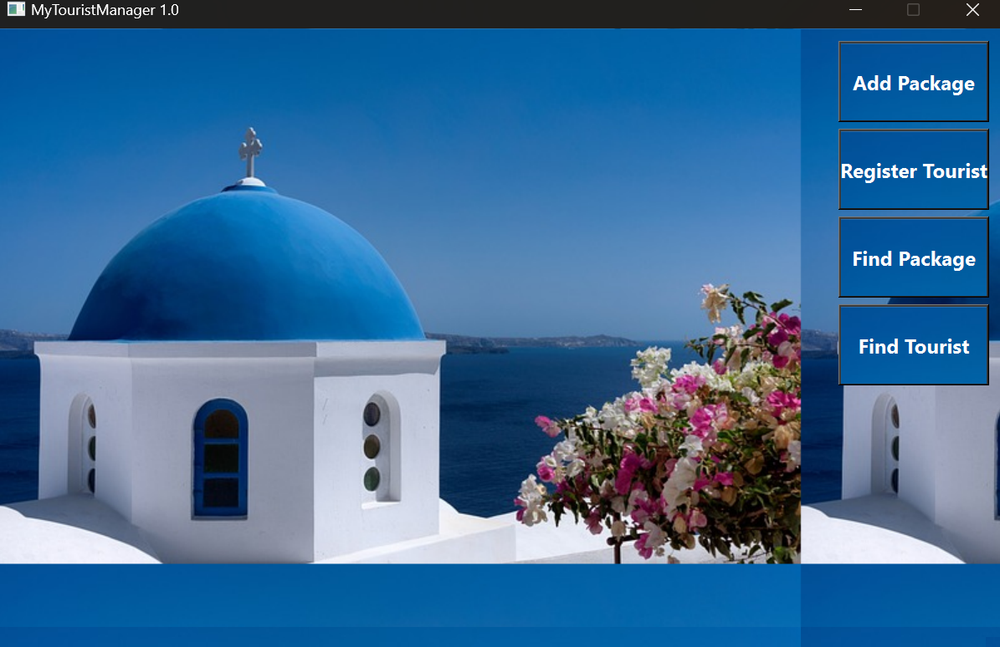
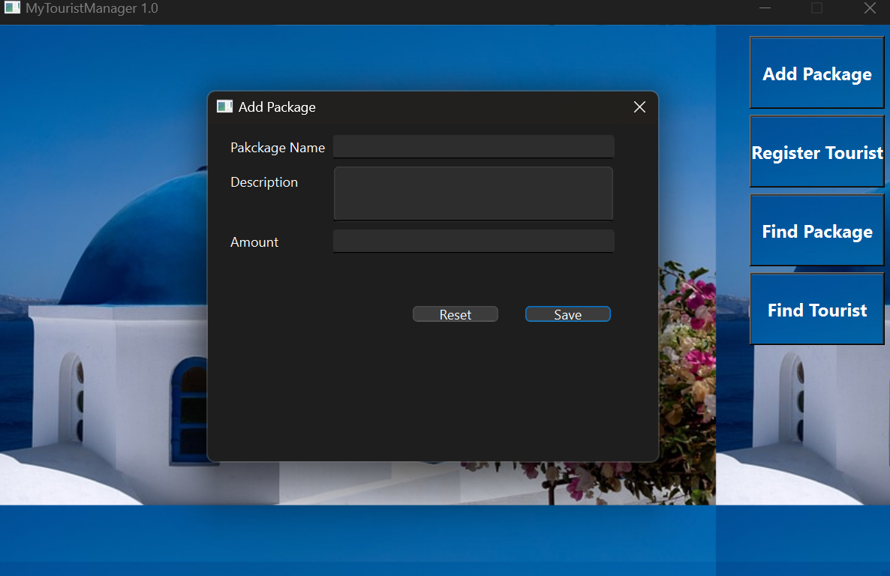
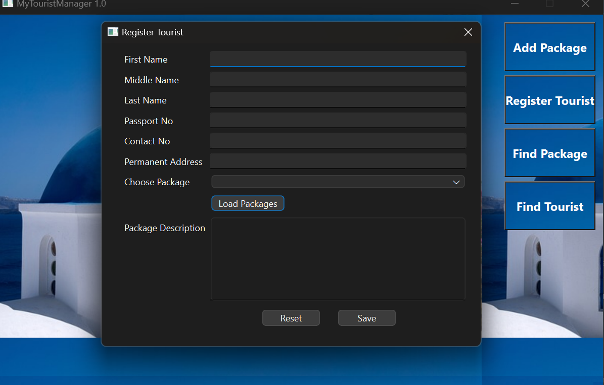
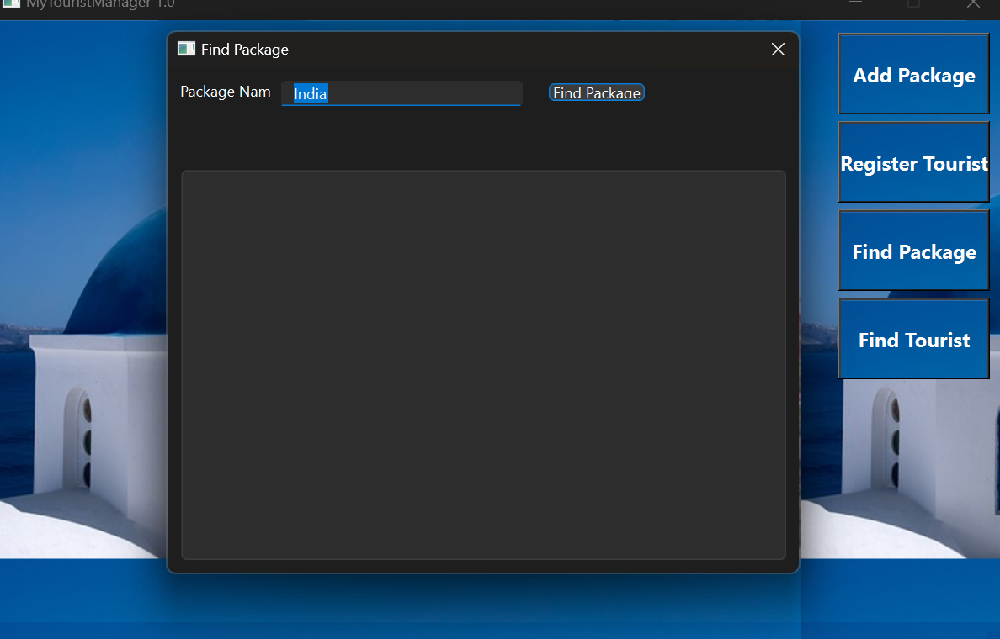
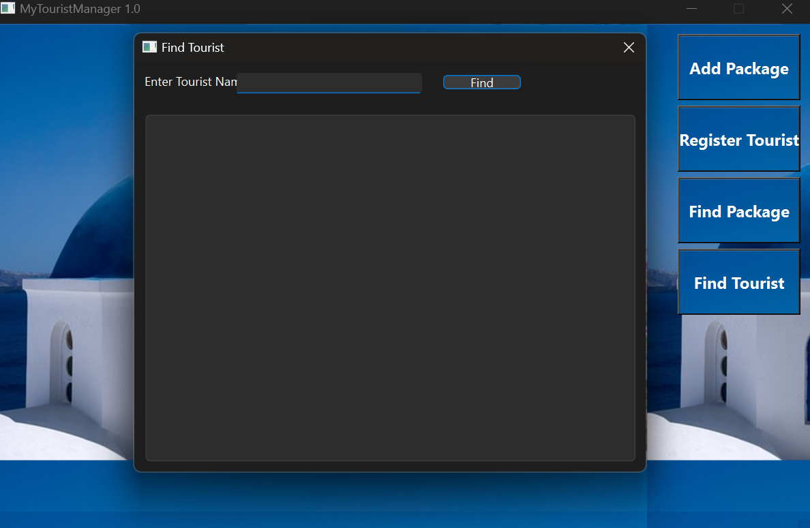

# VoyageVista - Tour Management System

  <!-- Replace with your actual logo image path -->

## Table of Contents
1. [Overview](#overview)
2. [Features](#features)
3. [Screenshots](#screenshots)

## Overview
VoyageVista is a comprehensive Tour Management System designed to streamline the process of managing tours and travel itineraries. The application utilizes the Qt framework for the graphical user interface and employs object-oriented programming concepts of C++. It allows users to manage packages, register tourists, find packages, and search for users. Additionally, it incorporates database management concepts for efficient data handling.

## Features
- **Add Tour Packages**: Add new tour packages to the data base.
- **User Management**: Create and manage user profiles of tourists.
- **Tour Scheduling**: Plan and schedule tours with detailed itineraries.

## Screenshots
Here are some screenshots showcasing the functionality of VoyageVista:

1. **Dashboard**
    

2. **Add Package Window**
     

3. **RegisterTourist window**
     

4. **Find Package Window**
     

5. **Find Tourist Window**
     

